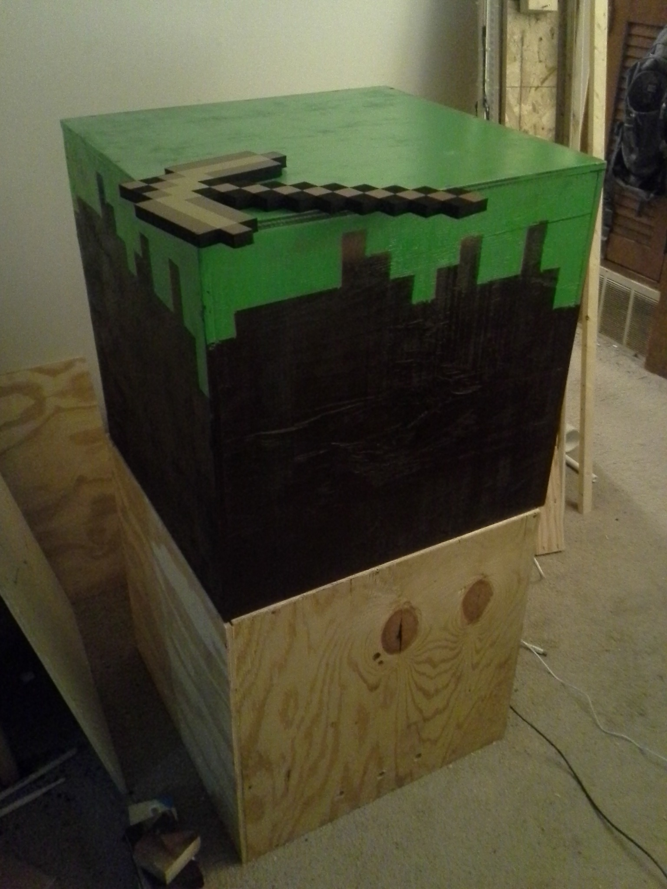
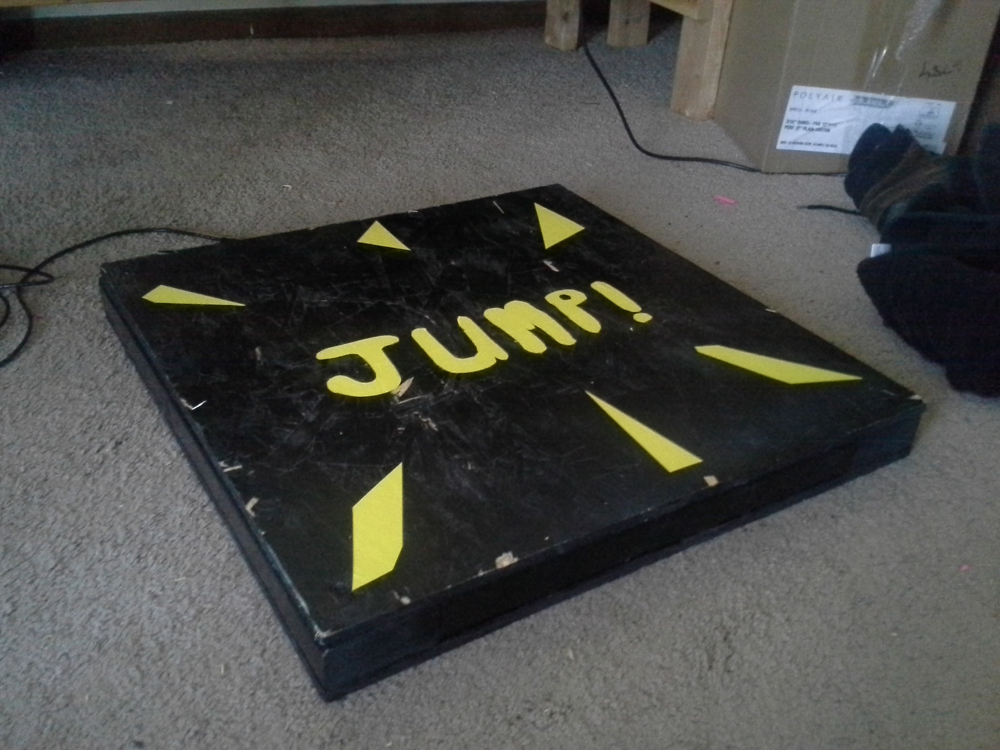
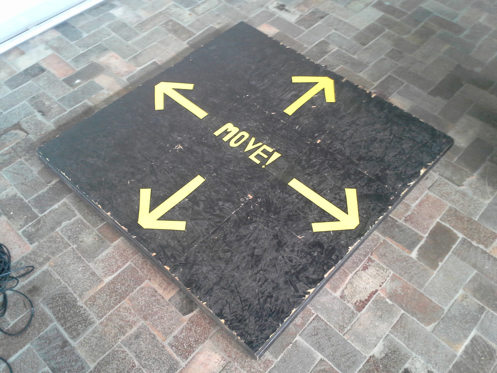
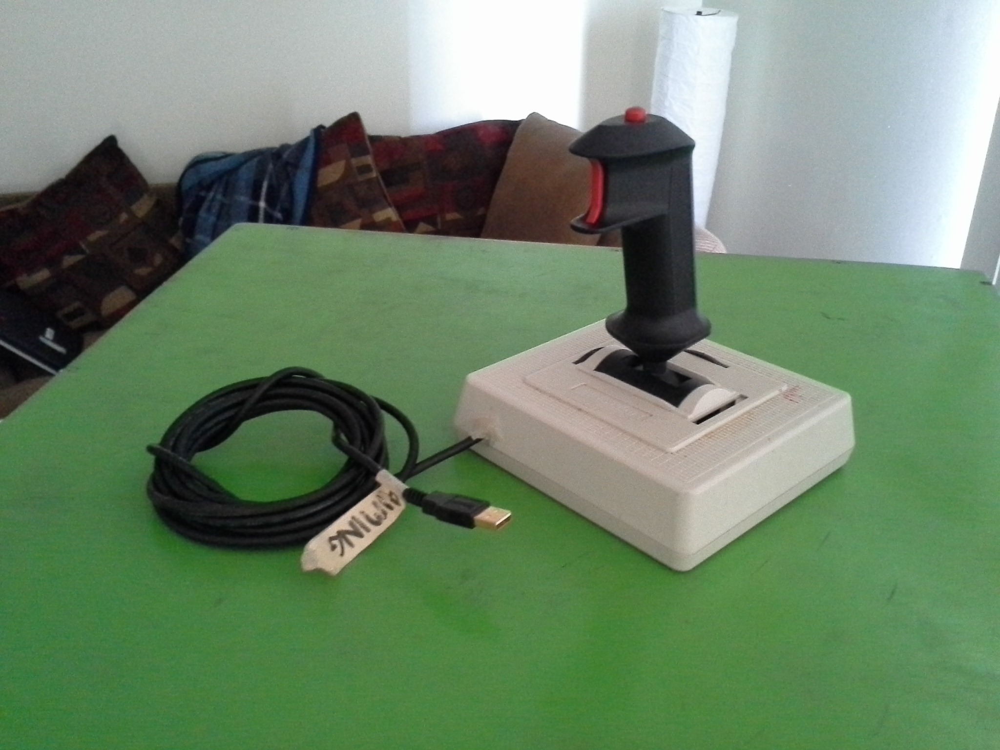

## Minecraft interface
* Interactive dirt block - a 2x2x2' cube painted to look like a dirt block, outfitted with a piezo transducer to detect when you hit it. A Teensy detects hits to the box and clicks the left mouse button in-game.
* Jump pad - a 2x2' pad to detect jumps from the player and translate them into jumps in-game (Space).
* Movement pad - a 4x4' directional pad to detect a player's steps and press corresponding movement keys (WASD) in-game.
* Aiming joystick - an old joystick retrofitted to move the mouse up and down to allow players to aim in-game.

## Images of pieces
### Interactive dirt block

### Jump pad

### Movement pad

### Aiming joystick

### Installation
.jpg)

.jpg)